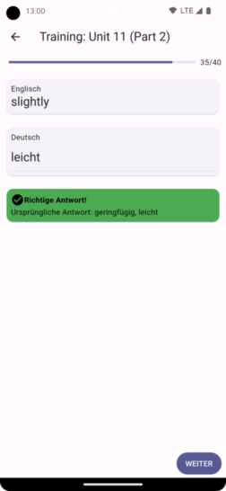
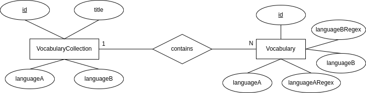

# Vocabulary Trainer

An app to learn vocabularies, developed with flutter.



## Build

First you need to download all dart packages.
```shell
flutter pub get
```

Before you can run the normal flutter build command, 
please run the following command to generate the required database code:

```shell
flutter packages pub run build_runner build
```

After that just the normal build command:

```shell
flutter build
```

## Database Structure

Database structure looks like this as ERM-Diagram:



Transformed to a RDBMS-Diagram (text form) the structure looks like this:

> VocabularyCollection(<u>id</u>, title, languageA, languageB)\
Vocabulary(<u>id</u>, languageA, languageARegex, languageB, languageBRegex, collectionID(FK))
>

To find out more about the meanings of the attributes look at
the file ["assets/vocabulary-collection.schema.json"](schema/vocabulary-collection.schema.json).\
*Note: The Vocabulary object (mentioned here) is the equivalent to 
the "vocabularies" key in the schema file.*